 

---

### 👋 Hi, I'm Mahesa.

I'm a **Software Engineer** who enjoys turning messy requirements into systems that are easier to understand, maintain, and scale.

I mostly live around **backend systems, business logic, APIs, databases, and infrastructure**, but I occasionally convince React components to behave too.

Currently working on an **ERP ecosystem**, with experience ranging from production Laravel applications and financial systems to industrial infrastructure, robotics, data, and teaching programming.

> I like boring software.
> Boring means it works.

---

### ⚙️ Things I work with

 

<table>
<tr>
<td width="33%" valign="top">

**Backend**

`Golang` · `Laravel`
`PHP` · `Node.js`
`REST API`

</td>
<td width="33%" valign="top">

**Frontend**

`Next.js` · `React`
`TypeScript`
`Tailwind CSS`

</td>
<td width="33%" valign="top">

**Data & Delivery**

`PostgreSQL` · `MySQL`
`SQL Server` · `Docker`
`Linux`

</td>
</tr>
</table>

---

### 🧩 Selected work

| Project                                                              | Stack                                                                                                                                                                                                                                                                                                                                                                                                                                                                           |
| :------------------------------------------------------------------- | :------------------------------------------------------------------------------------------------------------------------------------------------------------------------------------------------------------------------------------------------------------------------------------------------------------------------------------------------------------------------------------------------------------------------------------------------------------------------------ |
| **[BridgeYok ↗](https://bridgeyok-web.vercel.app)**                  | Go    ·   Next.js    ·   TypeScript    ·   PostgreSQL    ·   Redis  |
| **[Portfolio ↗](https://mahesa-yuztar.vercel.app)**                  | Next.js    ·   React    ·   TypeScript    ·   Tailwind CSS                                                                                   |
| **[Budgeting ↗](https://budgeting-khaki.vercel.app)**                | Next.js    ·   Prisma    ·   PostgreSQL    ·   Supabase                                                                                        |
| **[FruitGuard+ ↗](https://fruit-guard.netlify.app)**                 | HTML5    ·   JavaScript    ·   Tailwind CSS                                                                                                                                                                                   |
| **[Mentorin ↗](https://github.com/mahesayuztar/mentorin-education)** | Laravel    ·   PHP    ·   MySQL                                                                                                                                                                                                          |

There are also robots, ML experiments, enterprise systems, and a suspicious number of repositories created after midnight.

---

## 📊 GitHub things

 &nbsp; 

 

Top languages measure repository contents, not how many times I have stared at a Go compiler error.

---

### Have a problem worth giving a clear shape?

**[mahesa-yuztar.vercel.app](https://mahesa-yuztar.vercel.app)**

Build → break → understand → build it slightly less breakable.

 

